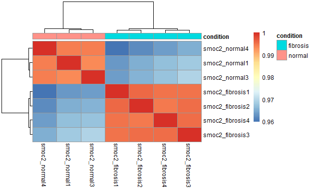
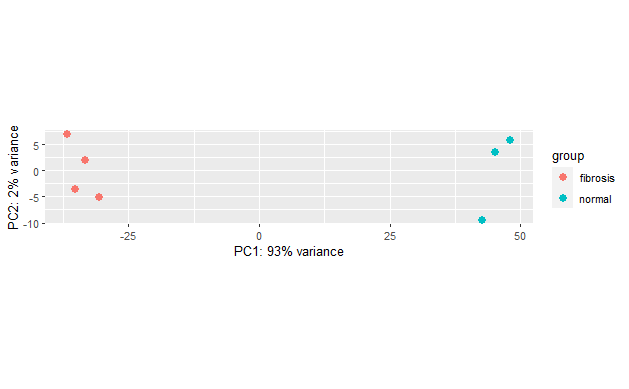
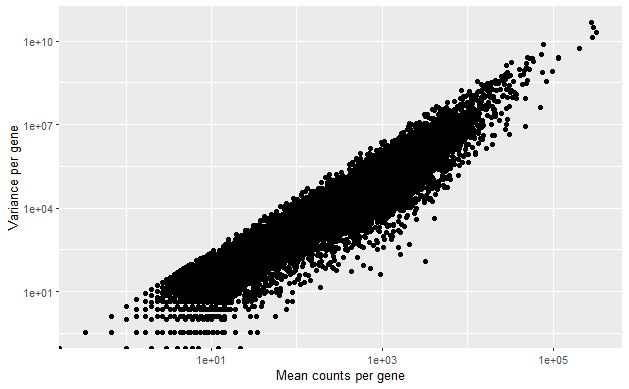
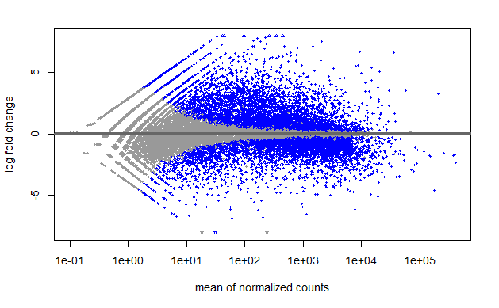

# Introduction


### What is smoc2?


Secreted modular calcium-binding protein 2 (Smoc2) is an acidic extracellular matrix glycoprotein 
and plays an important role in bone mineralization, cell-matrix interactions, collagen binding, and 
bone remodeling[1]. SMOCs also influence cell growth factor signaling, cell migration and proliferation, 
angiogenesis. SMOC2 has been shown to have increased expression in kidney fibrosis, or renal fibrosis, 
which is characterized as an aberrant repair response to chronic tissue injury. This results in an excess 
of extracellular matrix in the space between tubules and capillaries within the kidney. However, it is 
unknown how Smoc2 functions in the induction and progression of fibrosis[2].


1. Bornstein P, Sage EH. Matricellular proteins: extracellular modulators of cell function. Curr Opin Cell Biol 2002; 14:608–616. doi: 10.1016/S0955-0674(02)00361-7
2. Vannahme C, Gosling S, Paulsson M, Maurer P, Hartmann U. Characterization of SMOC-2, a modular extracellular calcium-binding protein. Biochem J 2003; 373:805–814. doi: 10.1042/bj20030532.


### A look at the dataset


This dataset cpmes from the research paper: 


**_Silencing SMOC2 ameliorates kidney fibrosis by inhibiting fibroblast to myofibroblast transformation._** 


The experimental design:

* There are four sample groups being tested:


    1. Normal control mice (wild type) with and without fibrosis 


    2. Smoc2 over-expressing mice with and without fibrosis. 


* There are three biological replicates for all normal samples and four replicates for all fibrosis samples. 

### Tools used

``` r
#Load library for DESeq2
library(DESeq2)

#Load library for RColorBrewer
library(RColorBrewer)

#Load library for pheatmap
library(pheatmap)

#Load library for tidyverse
library(tidyverse)
```

### Overview of workflow

Differential expression analysis:

1. Read in count matrix and create metadata


2. Quality control:

* Normalize counts to account for differences in library depth.

* Perform principal component analysis 

* Perform hierarchical clustering using heatmaps

* Identify potential sample outliers and major sources of variation in the data


3. Differential expression analysis:

    * Run differential expression analysis

    * Modeling counts

    * Shrinking log2 fold change


    * Testing for differential expression

# Importing read counts associated with genes

### Importing the data

``` r
data <- read_csv("C:/Users/gurka/Downloads/fibrosis_smoc2_rawcounts/fibrosis_smoc2_rawcounts.csv")
```

    ## New names:
    ## Rows: 47729 Columns: 8
    ## ── Column specification
    ## ────────────────────────────────────────────────────────────────────────────────────────────────────────────────────────────────────────────────────────────── Delimiter: "," chr
    ## (1): ...1 dbl (7): smoc2_fibrosis1, smoc2_fibrosis4, smoc2_normal1, smoc2_normal3, smoc2_fibrosis3, smoc2_normal4, smoc2_fibrosis2
    ## ℹ Use `spec()` to retrieve the full column specification for this data. ℹ Specify the column types or set `show_col_types = FALSE` to quiet this message.
    ## • `` -> `...1`

``` r
head(data)
```

    ## # A tibble: 6 × 8
    ##   ...1               smoc2_fibrosis1 smoc2_fibrosis4 smoc2_normal1 smoc2_normal3 smoc2_fibrosis3 smoc2_normal4 smoc2_fibrosis2
    ##   <chr>                        <dbl>           <dbl>         <dbl>         <dbl>           <dbl>         <dbl>           <dbl>
    ## 1 ENSMUSG00000102693               0               0             0             0               0             0               0
    ## 2 ENSMUSG00000064842               0               0             0             0               0             0               0
    ## 3 ENSMUSG00000051951              72              30             0             3              36             1              51
    ## 4 ENSMUSG00000102851               0               0             0             0               0             0               0
    ## 5 ENSMUSG00000103377               0               0             1             0               0             0               0
    ## 6 ENSMUSG00000104017               0               0             0             0               0             0               0

``` r
data <- subset (data[-c(1)])
```

### Putting together the metadata

Sample metadata is required in addition to the raw count data, data such as which of the samples correspond to each condition. To
create the metadata, a vector for each column is created and the vectors are combine into a data frame. The sample names are added as the row
names.

``` r
#create genotype vector
genotype = c('smoc2_oe','smoc2_oe','smoc2_oe','smoc2_oe','smoc2_oe','smoc2_oe','smoc2_oe')

#create condition vector
condition = c('fibrosis','fibrosis','fibrosis','fibrosis','normal','normal','normal')

#create dataframe

smoc2_metadata = data.frame(genotype, condition)

#Assign the row names of the data frame
rownames(smoc2_metadata) = c('smoc2_fibrosis1','smoc2_fibrosis2','smoc2_fibrosis3','smoc2_fibrosis4', 
                            'smoc2_normal1','smoc2_normal3', 'smoc2_normal4' )
```

# Normalization

Normalizing the raw counts to assess sample-level quality control is the first step in the workflow. The raw counts 
represent the number of reads aligning to each gene and should be proportional to the expression of the RNA in
the sample; however, there are factors other than RNA expression that can influence the number of reads aligning to each gene. 
The count data can be adjusted to remove the influence of these factors on the overall counts using normalization methods. 
The main factors often considered during normalization of count data are library depth, gene length, and RNA composition.

Differences in library size between samples can lead to many more reads being aligned to genes in one sample versus another sample.
Therefore, we need to adjust the counts assigned to each gene based on the size of the library prior to doing differential expression 
analysis.

Gene length normalization is another normalization factor often adjusted for. A longer gene generates a longer
transcript, which generates more fragments for sequencing. Therefore, a longer gene will often have more counts than a shorter
gene with the same level of expression. Since DE analysis compares expression levels of the same genes between conditions, we do 
not need to normalize for gene length. However, if you were to compare the expression levels of different genes, you would need 
to account for lengths of the genes.

Library composition effect is the third factor that needs to be taken into account for by adjusting library size, the composition 
of the library is also important. A few highly differentially expressed genes can skew many normalization methods that are not resistant 
to these outliers.

DESeq2 normalization uses a ‘median of ratios’ method of normalization. This method adjusts the raw counts for library size
and is resistant to large numbers of differentially expressed genes.

### Preparing the data for DESeq2

The data needs to be in a specific format to be accepted as an input to DESeq2. This requires the sample names in the 
metadata and counts datasets to be in the same order. Therefore, the row names of our metadata need to be in the same 
order as the column names of our counts data.

Currently the order is not the same, and this can be confirmed with the all() function to compare the row and coloumn order
which will return FALSE.The match() function can be used to determine the order needed. The first argumnent to the function 
is a vector of values in the order desired, and the second is a vector of values to be reordered.

Reordering can be done with the match() function by using the output of match() to reorder the rows of the metadata to be in
the same order as the columns in the count data. To do this the indices output by match() need to be extracted to a variable. 
Then, rearrange the metadata by using the square brackets and adding the index to the rows position. The samples should now be 
in the same order for both datasets, which can be confirmed by running the all() function once again

``` r
#check if the column orders are the same with the all function
all(rownames(smoc2_metadata) ==  colnames(data))

[1] FALSE
```

``` r
#determine the matching order between the vectors using match()
match(colnames(data), rownames(smoc2_metadata))

[1] 1 4 5 6 3 7 2
```


``` r
#use the match() function to reorder the column of the raw counts
reorder_idx = match(colnames(data), rownames(smoc2_metadata))

#reorder the metadata table
reordered_smoc2_meta = smoc2_metadata[reorder_idx, ]

#view the new table
reordered_smoc2_meta

                     genotype condition
     smoc2_fibrosis1 smoc2_oe  fibrosis
     smoc2_fibrosis4 smoc2_oe  fibrosis
     smoc2_normal1   smoc2_oe    normal
     smoc2_normal3   smoc2_oe    normal
     smoc2_fibrosis3 smoc2_oe  fibrosis
     smoc2_normal4   smoc2_oe    normal
     smoc2_fibrosis2 smoc2_oe  fibrosis
```


``` r
#check to see if the column and row names are in the same order
all(rownames(reordered_smoc2_meta) ==  colnames(data))

[1] TRUE
```

### Creating the DESeq2 DataSet (DDS)

Now a DESeq2 dataSet (DDS) needs to be created to store the raw counts and metadata to use for performing 
the differential expression analysis. The DESeq2 object is created with the **DESeqDataSetFromMatrix()** function.
This function takes as input the raw counts, associated metadata, and a design formula detailing which conditions 
in the metadata to use for differential expression analysis.

This function creates a DESeq2 object, of the class Ranged Summarized Experiment. This is a list-like object with slots 
available for the data it will generate throughout the analysis. Currently, it only has a few of the slots filled with the
count data, metadata, and design information.

``` r
# Create a DESeq2 object
dds_smoc2 = DESeqDataSetFromMatrix(countData = data,
                                   colData = reordered_smoc2_meta,
                                   design = ~ condition)
```

### Estimating size factors

The function estimateSizeFactors() can be used on the DESeq2 object to calculate the normalized counts and assign the output to a 
slot in the DESeq2 object, by re-assigning to DDS. DESeq2 will use these size factors to normalize the raw counts. The raw counts for each 
sample are divided by the associated sample-specific size factor for normalization. To view the size factors used for normalization, the 
sizeFactors() function can be used.

``` r
#estimating the size factors and feeding them back to the dds object by reassigning to the dds object
dds_smoc2 = estimateSizeFactors(dds_smoc2)

#viewing the size factors
sizeFactors(dds_smoc2)

     smoc2_fibrosis1 smoc2_fibrosis4   smoc2_normal1   smoc2_normal3 smoc2_fibrosis3   smoc2_normal4 smoc2_fibrosis2 
           1.4319832       1.0826799       0.7106482       0.7989734       1.2480024       0.8482426       1.1189642
```

## Extracting normalized counts

Once the size factors have been calculated and added to the DESeq2 object, the normalized counts can be extracted from it. To extract 
the normalized counts from the DESeq2 object the ```counts()``` function can be used while specifying the normalized counts with the
```normalized = TRUE``` argument. If the default was left as ```normalized = FALSE```, then the raw counts would be extracted from the oject.

``` r
#once factors are calculated and reassigned then the normalized counts can be extracted using the counts function with normalized=TRUE argument
normalized_smoc2_counts = counts(dds_smoc2, normalized=TRUE)
```

``` r
head(normalized_smoc2_counts)


          smoc2_fibrosis1 smoc2_fibrosis4 smoc2_normal1 smoc2_normal3 smoc2_fibrosis3 smoc2_normal4 smoc2_fibrosis2
     [1,]         0.00000         0.00000      0.000000      0.000000          0.0000      0.000000         0.00000
     [2,]         0.00000         0.00000      0.000000      0.000000          0.0000      0.000000         0.00000
     [3,]        50.27992        27.70902      0.000000      3.754818         28.8461      1.178908        45.57786
     [4,]         0.00000         0.00000      0.000000      0.000000          0.0000      0.000000         0.00000
     [5,]         0.00000         0.00000      1.407166      0.000000          0.0000      0.000000         0.00000
     [6,]         0.00000         0.00000      0.000000      0.000000          0.0000      0.000000         0.00000
```


### Log transform the normalized counts

Before visualizing the data the normalized counts should be log transformed to improve the visualization of the clustering.
For RNA-Seq data, DESeq2 uses a variance stabilizing transformation (VST), which is a logarithmic transformation that moderates the
variance across the mean. The normalized counts can be transformed by using the ```DESeq2 vst()``` function on the DESeq2 object. 
The ```blind=TRUE``` argument specifies that the transformation should be blind to the sample information given in the design formula; 
this argument should be specified when performing quality assessment.

# Unsupervised clustering analysis

With the counts normalized for library size, the counts between the different samples can now be compared. To assess the quality of 
experiment the samples are compared to each other with regards to gene expression. These comparisons are done visually though unsupervised
clustering analysis using hierarchical clustering heatmaps and PCA these are performed to get an idea of how similar the biological 
replicates are to each other and to identify outlier samples and major sources of variation present in the dataset.

``` r
#Unsupervised clustering analyses: log transformation

#transform the normalized counts
vsd_smoc2 = vst(dds_smoc2, blind=TRUE)
```

### Hierarchical clustering with a correlation heatmap

Hierarchical clustering with heatmaps is used to assess the similarity in gene expression between the different samples in a dataset. This
technique is used to explore how similar replicates are to each other and whether the samples belonging to different sample groups
cluster separately. The heatmap is created by using the gene expression correlation values for all pairwise combinations of samples in the dataset, 
with the value 1 being perfect correlation. The hierarchical tree shows which samples are more similar to each other and the colors in the heatmap 
depict the correlation values. We expect the biological replicates to cluster together and sample conditions to cluster apart. Since the majority of 
genes should not be differentially expressed, samples should generally have high correlations with each other. Samples with correlation values below 
**0.8** may require further investigation to determine whether these samples are outliers or have contamination.

To create the heatmap the VST-transformed normalized counts will be extracted as a matrix from the vsd object using the ```assay()``` function. 
Then, the pairwise correlation values between each pair of samples will be computed using the ```cor()``` function

After generating the correlation values, the pheatmap package can be used to create the heatmap. The annotation argument selects which factors in the
metadata to include as annotation bars. Use the ```select()``` function from the ```dplyr``` package to select the condition column in the metadata.

``` r
#Hierarchical clustering with correlation heatmaps

#extract the vst matrix (of transformed counts) from the object
vsd_mat_smoc2 = assay(vsd_smoc2)

#compute the pairwise correlation values between samples
vsd_cor_smoc2 = cor(vsd_mat_smoc2)

#view correlation statistics
vsd_cor_smoc2

                     smoc2_fibrosis1 smoc2_fibrosis4 smoc2_normal1 smoc2_normal3 smoc2_fibrosis3 smoc2_normal4 smoc2_fibrosis2
     smoc2_fibrosis1       1.0000000       0.9948457     0.9631782     0.9637385       0.9949621     0.9597660       0.9958622
     smoc2_fibrosis4       0.9948457       1.0000000     0.9668704     0.9671808       0.9951846     0.9635529       0.9946819
     smoc2_normal1         0.9631782       0.9668704     1.0000000     0.9935479       0.9678895     0.9940744       0.9651063
     smoc2_normal3         0.9637385       0.9671808     0.9935479     1.0000000       0.9691965     0.9942610       0.9656578
     smoc2_fibrosis3       0.9949621       0.9951846     0.9678895     0.9691965       1.0000000     0.9650676       0.9952111
     smoc2_normal4         0.9597660       0.9635529     0.9940744     0.9942610       0.9650676     1.0000000       0.9618977
     smoc2_fibrosis2       0.9958622       0.9946819     0.9651063     0.9656578       0.9952111     0.9618977       1.0000000
```

The output fromthe heatmap shows that the biological replicates cluster together and the conditions separate. This is encouraging since
differentially expressed genes between the conditions are likely to be driving this separation. Also, all correlation values are expectedly 
high without any outlier samples. If the replicates did not cluster as expected, the heatmap could be plotted with all of the metadata and 
see whether any other factor corresponds to the separation of the samples. If so, you would want to see if you get similar results with the 
PCA.

``` r
#plot the heatmap
pheatmap(vsd_cor_smoc2, annotation = select(smoc2_metadata, condition))
```



### Principal component analysis

PCA is a technique used to emphasize the variation present in a dataset. PCA finds the principal components of a dataset, with the first principal
component, or PC1, representing the greatest amount of variance in the data. Genes are given quantitative scores based on how much they influence 
the different PCs. A ‘per sample’ PC value is computed by taking the product of the influence and the normalized read count for each gene and summing 
across all genes.For PCA we generally plot these per sample PC values. Samples that cluster together have more similar gene expression profiles than 
samples that cluster apart, especially for the most variant genes.

This is a good method to explore the quality of the data as we hope to see replicates cluster together and conditions to separate on PC1. Sample 
outliers and major sources of variation can also be identified with this method.

Perform PCA using DESeq2’s ```plotPCA()``` function to plot the first two PCs. This function takes as input the transformed vsd object, and the
```intgroup``` argument to specify what factor in the metadata to use to color the plot. The sample groups, normal and fibrosis, separate well on PC1. 
This means that the condition corresponds to PC1, which represents 88% of the variance in the data, while 4% is explained by PC2. This is great since 
it seems that a lot of the variation in gene expression in the dataset can likely be explained by the differences between sample groups. However, if 
the samples do not separate by PC1 or PC2, the effect of the condition could be small or there are sometimes other larger sources of variation present. 
You can color the PCA by other factors, such as age, sex, batch, etcetera, to identify other major sources of variation that could correspond to one 
of the large principal components.

Perform PCA to look how the samples cluster and whether the condition of interest corresponds with
the principal components explaining the most variation in the data.

``` r
#plot pca
plotPCA(vsd_smoc2, intgroup="condition")
```




### Running the DE analysis

Now that we have explored the quality of our samples, removed any outlier samples, and assessed the major sources of variation present, we can start the 
differential expression analysis with DESeq2. by performing the differential expression analysis with DESeq2, we are trying to identify which genes have 
significant differences in expression between the normal and fibrosis sample groups.

The differential expression analysis with DESeq2 consists of roughly three steps: 

1. Fitting the raw counts for each gene to the DESeq2 negative binomial model and testing for differential expression.
2. Shrinking the log2 fold changes.
3. Extracting and visualizing the results.


The design formula is an important part of modeling, telling DESeq2 the known major sources of variation to control for, or regress out, as well as, the condition 
of interest to use for differential expression testing. Also, the factor names in the design formula need to exactly match the column names in the metadata.

``` r
# Run DESeq2 analysis 
dds_smoc2 <- DESeq(dds_smoc2)

     using pre-existing size factors

     estimating dispersions

     gene-wise dispersion estimates

     mean-dispersion relationship

     final dispersion estimates

     fitting model and testing
```

### Mean and variance

explore the fit of the smoc2 data to the negative binomial model by plotting the dispersion estimates using the ```plotDispEsts()``` function. The dispersion 
estimates are used to model the raw counts; if the dispersions don’t follow the assumptions made by DESeq2, then the variation in the data could be poorly estimated 
and the DE results could be less accurate.

The assumptions DESeq2 makes are that the dispersions should generally decrease with increasing mean and that they should more or less follow
the fitted line. The goal of the differential expression analysis is to determine whether a gene’s mean expression between sample groups is
different given the variation within groups. This is determined by testing the probability of the log2 fold changes between groups being significantly different from zero. 
The log2 fold changes are found by the log of the one sample group mean, therefore, to model the counts requires information about the mean and variation in the data. To
explore the variation in the data, the variance will be observed in gene expression relative to the mean. Variance is the square of the standard deviation, representing 
how far away the expression of the individual samples are from the means.

For RNA-Seq data, the variance is generally expected to increase with the gene’s mean expression. To observe this relationship, calculate the means and variances for
every gene of the normal samples using the ```apply()``` function.

``` r
# Calculating mean for each gene (each row)
mean_counts = apply(data[, 1:3], 1, mean)
head(mean_counts)

[1]  0.0000000  0.0000000 34.0000000  0.0000000  0.3333333  0.0000000
``` 

``` r
# Calculating variance for each gene( each row)
variance_counts = apply(data[, 1:3], 1, var)
head(variance_counts)

[1]    0.0000000    0.0000000 1308.0000000    0.0000000    0.3333333    0.0000000
```


``` r
#Plotting relationship between mean and variance:

# Creating data frame with mean and vairance for every gene
df = data.frame(mean_counts, variance_counts)
head(df)

       mean_counts variance_counts
     1   0.0000000       0.0000000
     2   0.0000000       0.0000000
     3  34.0000000    1308.0000000
     4   0.0000000       0.0000000
     5   0.3333333       0.3333333
     6   0.0000000       0.0000000
```


Create a data frame for plotting with ```ggplot2```. Plot the mean and variance values for each gene using log10 scales. Each black dot represents a gene.


#### Relationship between mean and variance

``` r
ggplot(df) +
  geom_point(aes(x=mean_counts, y=variance_counts)) +
  scale_y_log10() +
  scale_x_log10() +
  xlab("Mean counts per gene") +
  ylab("Variance per gene")
```



The variance in gene expression increases with the mean. This is expected for RNA-Seq data. Also, note how the range in values for variance is greater for 
lower mean counts than higher mean counts. This is also expected for RNA-Seq count data.

### Dispersion

A measure of the variance for a given mean is described by a metric called dispersion in the DESeq2 model. The DESeq2 model uses dispersion to assess the variability in 
expression when modeling the counts.

The DESeq2 model calculates dispersion as being indirectly related to the mean and directly related to the variance of the  data using the formula displayed. 
So, an increase in variance will increase dispersion, while an increase in mean will decrease dispersion. For any two genes with the same mean expression, 
the only difference in dispersion will be based on differences in variance. To check the fit of the data to the DESeq2 model, it can be useful to look at 
the dispersion estimates.


#### Plotting dispersion estimates

To plot the dispersions relative to the means for each gene, use the ```plotDispEsts()``` function on the DESeq2 object. Each black dot is a gene with associated 
mean and dispersion values. Expect dispersion values to decrease with increasing mean, which is what is seen. With only a few replicates for RNA-Seq experiments, 
gene-wise estimates of dispersion are often inaccurate, so DESeq2 uses information across all genes to determine the most likely estimates of dispersion for a 
given mean expression value, shown with the red line in the figure. Genes with inaccurately small estimates of variation could yield many false positives, or 
genes that are identified as DE, when they are really not. Therefore, the original gene-wise dispersion estimates, shown as the black dots in the figure, are 
shrunken towards the curve to yield more accurate estimates of dispersion, shown as blue dots. The more accurate, shrunken dispersion estimates are used to model the
counts for determining the differentially-expressed genes. Extremely high dispersion values, shown surrounded by blue circles, are not shrunken, due to the likelihood 
that the gene may have higher variability than others for biological or technical reasons and reducing the variation could result in false positives. The strength
of the shrinkage is dependent on the distance from the curve and sample size. Larger numbers of replicates can estimate the mean and variation more accurately, 
so yield less shrinkage.

Worrisome plots would include a cloud of data that doesn’t follow the curve or dispersions that don’t decrease with increasing mean. These problems can often be explained 
by sample outliers or contamination.


``` r
#plot dispersion estimates
plotDispEsts(dds_smoc2)
```
The dispersion estimates are used to model the raw counts; if the dispersions don’t follow the assumptions made by DESeq2, then the
variation in the data could be poorly estimated and the DE results could be less accurate. The assumptions DESeq2 makes are that the dispersions should generally decrease with increasing mean and that they should more or less follow
the fitted line.





### extracting the results of DE analysis

DESeq2 will perform the Wald test for pairwise comparisons to test for differences in expression between
two sample groups for the condition of interest, in this case, condition. The sample groups for condition 
are fibrosis and normal. The results of the testing can be extracted using the ```results()``` function and 
specifying a significance level, or alpha value, using the ```alpha``` argument. You can choose the alpha 
based on how stringent you want to be with your analysis. Lower alpha values indicate less probability of 
identifying a gene as DE when it is actually not. We will use a standard alpha of 0-point-05. The top of 
the output shows **"log2 foldchange condition normal versus fibrosis”**, indicating that fibrosis is the 
base level of comparison. This means that all log2 fold changes represent the normal group relative to the 
fibrosis group.

Contrasts specify the sample groups to compare and can be given directly to the ```results()``` function 
using the ```contrast``` argument. Within the combine function, we need to specify the condition of interest, 
level to compare, and base level. To specify the normal sample group as the base level for condition, we
could create the contrast defining normal as the base level and fibrosis as the level to compare. Note that 
the condition of interest and sample groups for the condition need to match the names in the metadata.

Now the results give log2 fold changes of the fibrosis group relative to normal.


``` r
# The syntax for DESeq2 contrasts is

# results(dds,
#         contrast = c("condition_factor", "level_to_compare", "base_level"),
#         alpha = 0.05)

smoc2_results = results(dds_smoc2,
                        contrast = c("condition", "fibrosis", "normal"),
                        alpha = 0.05)
```

``` r
head(smoc2_results)

     log2 fold change (MLE): condition fibrosis vs normal 
     Wald test p-value: condition fibrosis vs normal 
     DataFrame with 6 rows and 6 columns
        baseMean log2FoldChange     lfcSE      stat      pvalue        padj
       <numeric>      <numeric> <numeric> <numeric>   <numeric>   <numeric>
     1  0.000000             NA        NA        NA          NA          NA
     2  0.000000             NA        NA        NA          NA          NA
     3 22.478090        4.49814  0.829291  5.424085 5.82520e-08 2.54201e-07
     4  0.000000             NA        NA        NA          NA          NA
     5  0.201024       -1.59170  3.816946 -0.417009 6.76672e-01          NA
     6  0.000000             NA        NA        NA          NA          NA
```


### MA plot

The MA plot shows the  mean of the normalized counts versus the log2 fold changes for all genes tested. 
The DESeq2 function plotMA() can be used to create the plot and the genes that are significantly DE are colored red. 
Note the large log2 foldchanges, particularly for genes with lower mean count values. 
These fold changes are unlikely to be as accurate for genes that have little information associated with them, 
such as genes with low numbers of counts or high dispersion values.

``` r
plotMA(smoc2_results, ylim=c(-8,8))
```


### LFC shrinkage


To improve the estimated fold changes we can use log2 foldchange shrinkage. For genes with low amounts of information available, shrinkage uses information from all genes to generate more likely, lower, log2 fold change estimates, similar to what we did with dispersions. DESeq2 has the ```lfcShrink()``` function to generate the shrunken log2 foldchanges. We need to specify the DESeq2 object, the contrast, and our results object.


These shrunken log2 foldchanges should be more accurate; however, shrinking the log2 foldchanges will not affect the number of differentially expressed genes returned, only the log2 fold change values. Now that we have accurate fold changes, we can extract the significant DE genes and perform further visualizations of results.

``` r
smoc2_results = lfcShrink(dds_smoc2,
                          contrast = c("condition", "fibrosis", "normal"),
                          type = 'ashr',
                          res = smoc2_results)

                          
     using 'ashr' for LFC shrinkage. If used in published research, please cite:
         Stephens, M. (2016) False discovery rates: a new deal. Biostatistics, 18:2.
         https://doi.org/10.1093/biostatistics/kxw041
```


### Create a results dataframe

Now that we have extracted our results, we can get a nice overview of the number of differentially expressed genes there are for our designated alpha level using the summary() function. It will output the numbers/percentages of up- and down-regulated genes, as well as, give information about independent filtering and outliers removed.


``` r
summary(smoc2_results)

     out of 29556 with nonzero total read count
     adjusted p-value < 0.05
     LFC > 0 (up)       : 5776, 20%
     LFC < 0 (down)     : 5332, 18%
     outliers [1]       : 15, 0.051%
     low counts [2]     : 7207, 24%
     (mean count < 1)
     [1] see 'cooksCutoff' argument of ?results
     [2] see 'independentFiltering' argument of ?results
```
DESeq2’s ```summary()``` function provides the number of differentially expressed genes for the alpha level and information about the number of genes filtered. Our results give
over 10,000 genes as DE, which is the sum of the DE genes with log2 fold changes less than 0 and those with fold changes greater than 0. This is a lot of genes to sift through. If we wanted to return the genes most likely to be biologically relevant, we could also include a log2 fold change threshold. Oftentimes, a log2 fold change threshold isn’t preferred. However, it can be helpful when dealing with such large numbers of DE genes.

``` r
smoc2_results = results(dds_smoc2, contrast = c("condition", "fibrosis", "normal"), lfcThreshold = 0.32, alpha = 0.05)
```

Now we implemented a log2 fold change threshold of 1.25 fold (log2 0.32) when testing for significant genes. Now we can use these results to subset only the significant genes with p-adjusted values less than 0.05.

``` r
# Save results as a data frame
smoc2_res_all <- data.frame(smoc2_results)
```


Now let’s look at the values in the results table and identify the differentially expressed genes. To determine significant DE genes, we will be using the p-values adjusted for multiple test correction in the last column. The reason for this is that for every gene tested with an alpha of 0-point-05, there is a 5% chance that the gene is called as DE when it is not, yielding false positives. If we were to test the roughly 47,000 genes in the raw counts file, we would have about 5% or over 2,000 genes as false positives. It would be difficult to identify the true positives, or genes that are called DE when they truly are, from the false. Therefore, multiple test correction is performed by DESeq2 using the
Benjamini-Hochberg, or BH-method, to adjust p-values for multiple testing and control the proportion of false positives relative to true. Using the BH-method and an alpha value of 0-point-05, if we had 1,000 genes identified as DE, we would expect 5% of the DE genes to be false positives, or 50 genes. To reduce the number of genes tested, DESeq2 automatically filters out genes unlikely to be truly differentially expressed prior to testing, such as genes with zero counts across all samples, genes with low mean values across all samples, and genes with extreme count outliers. 


5.  Significant DE genes - fold-change threshold To test for significant
    genes using both an alpha value threshold and a log2 foldchange
    threshold different from 0, we need to re-run the results function.
    Let’s use a small 1-point-25-foldchange threshold, which equals
    0-point-32 on the log2 scale, by adding the lfcThreshold argument to
    our results() function. While using any log2 fold change cut-off
    increases the risk of losing biologically relevant genes, by using a
    very small log2 foldchange threshold, we are hoping to reduce the
    risk that the genes more biologically meaningful.

6.  Significant DE genes - summary Now that we have the results, we need
    to re-shrink the foldchanges, then run the summary() function again.
    Now, we have returned just over 6,000 DE genes.

7.  Results - annotate To better understand which genes the results
    pertain to, we can use the annotables package to quickly obtain gene
    names for the Ensembl gene IDs using the table of gene annotations
    for the Grch38 mouse genome build.

8.  Results - extract To annotate the genes with gene names and
    descriptions, we need to first turn our results table into a data
    frame using the data-dot-frame() function. Then, after changing the
    row names to a column, we can merge the gene names and descriptions
    with our results using the left_join() function and merging by
    Ensembl gene IDs. Now we have our entire results table.

9.  Significant DE genes - arrange To extract the significant DE genes,
    we’ll subset the results table, using the subset() function, for
    genes with p-adjusted values less than the alpha value of
    0-point-05. We should see all p-adjusted values are less than
    0-point-05 and log2 foldchanges are greater than the absolute value
    of 0-point-32. We will use the arrange() function to order the genes
    by p-adjusted values to generate the final table of significant
    results. We can explore this table for interesting or expected genes
    with a high probability of being related to kidney fibrosis.

10. Significant DE genes If we look up many of these top genes, we will
    find known roles associated with fibrosis, which is an encouraging
    and exciting result for us.

To reduce the number of DE genes that we are returning and to reduce the
likelihood of the DE genes being biologically meaningful, we are going
to use a small log2 fold change threshold to determine the DE genes.

``` r
# Subset the results to only return the significant genes with p-adjusted values less than 0.05
smoc2_res_sig <- subset(smoc2_res_all, padj < 0.05)
```

``` r
head(smoc2_res_sig)
```

    ##      baseMean log2FoldChange      lfcSE       stat       pvalue         padj
    ## 3    22.47809      4.4981432 0.82929064   5.038213 4.698974e-07 2.829520e-06
    ## 17   12.06950     -2.3959881 0.60066414  -3.456155 5.479409e-04 2.278479e-03
    ## 33 1380.35712     -0.8942696 0.09748260  -5.890996 3.838750e-09 2.815588e-08
    ## 35 2522.97515     -1.9163511 0.14944995 -10.681510 1.242343e-26 2.749899e-25
    ## 40   11.55182      2.3983021 0.70397545   2.952237 3.154811e-03 1.160401e-02
    ## 45 1921.19192     -0.9062709 0.08444206  -6.942877 3.841942e-12 3.594718e-11

4.  Visualizing results - Volcano plot In addition to the MA plot
    explored previously, another useful plot providing a global view of
    the results is the volcano plot, which shows the fold changes
    relative to the adjusted p-values for all genes. First, using all
    results, wt_res_all, convert the row names to a column called
    ensgene, then create a column of logical values indicating if the
    gene is DE using the mutate() function, with p-adjusted value
    threshold less than 0-point-05. Then, use ggplot2 to plot the log2
    foldchange values versus the -log10 adjusted p-value. The points for
    the genes should then be colored by whether they are significant
    using the threshold column.

5.  Visualizing results - Volcano plot We can zoom in on the volcano
    plot to visualize better the significance cut-off using the ylim()
    function within ggplot2.

To explore the results, visualizations can be helpful to see a global
view of the data, as well as, characteristics of the significant genes.
Usually, we expect to see significant genes identified across the range
of mean values, which we can plot using the MA plot. If we only see
significant genes with high mean values, then it could indicate an issue
with our data. The volcano plot helps us to get an idea of the range of
fold changes needed to identify significance in our data.

``` r
# Generate logical column 
smoc2_res_all <- data.frame(smoc2_results) %>% mutate(threshold = padj < 0.05)
```

``` r
# Create the volcano plot
ggplot(smoc2_res_all) + 
  geom_point(aes(x = log2FoldChange, y = -log10(padj), color = threshold)) + 
  xlab("log2 fold change") + 
  ylab("-log10 adjusted p-value") + 
  theme(legend.position = "none", 
        plot.title = element_text(size = rel(1.5), hjust = 0.5), 
        axis.title = element_text(size = rel(1.25)))
```

    ## Warning: Removed 25395 rows containing missing values (geom_point).

<!-- -->
